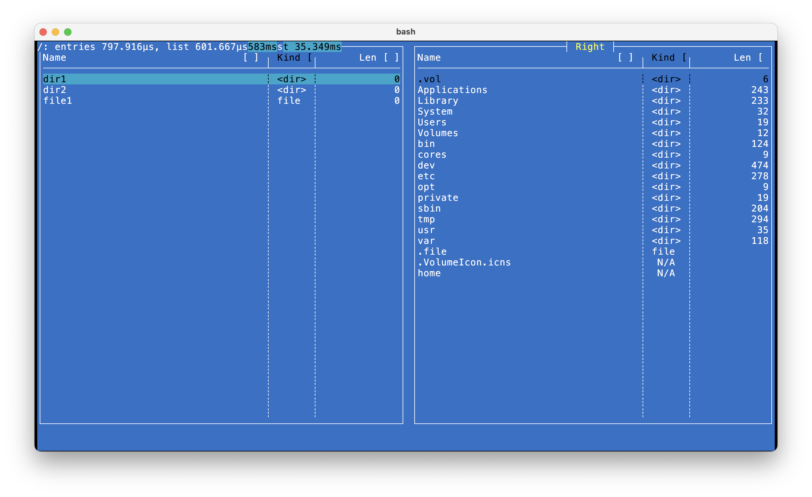
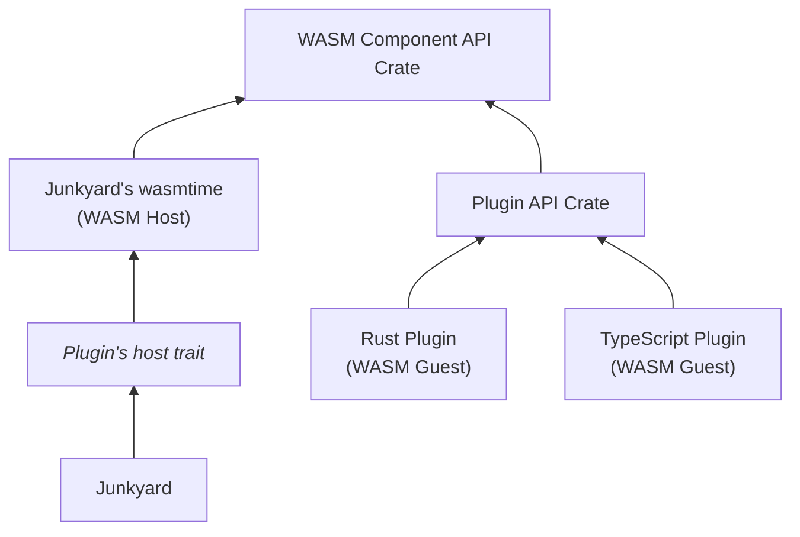

# Building an Extension
steps one can follow to build an extension using the WASM Component Model

---
layout: default
---
# junkyard
the classical commander - https://github.com/alexandruradovici/junkyard

<div align="center">

</div>

---
---
# Tools
that you need to build an extension

| Tool | Description |
|-|-|
| wit-bindgen | Generates the guest interfaces that the plugin uses | 
| wasmtime | Rust crate used to run WASM Components, will be included in your Rust application. it provides a macro to generate the host interfaces that interact with the pluign. |
| cargo-component | Builds the component from a rust project (Rust < 1.82 )
| rust *target wasm32-wasip2* | Builds the component from a rust project (Rust >= 1.82 )
| jco | Build a component from JavaScript |

---
---
# Step 1 - Define the interface using WIT

```WIT {1|3-16|17-20|21-24|all}
package junkyard-vfs:vfs-plugin;

interface vfs {
    use vfs-host.{absolute-path};

    variant seek { ... }
    enum kind { ... }
    record stat { ... }
    resource file { ... }

    resource filesystem {
        read-dir: func(path: borrow<absolute-path>) -> result<list<absolute-path>, string>;
        // ...
    }
    init: func() -> result<filesystem>;
}
interface vfs-host {
    resource absolute-path { ... }
    create-absolute-path: func(s: string) -> absolute-path;
}
world vfs-plugin {
    import vfs-host;
    export vfs;
}
```

---
---
# Step 2 - create an API create
that exports the data types, resources and interfaces

```rust {1,15|3|4-9|10-12|all}
wasmtime::component::bindgen!({
    async: false,
    path: "wit/vfs.wit",
    additional_derives: [
        Eq,
        PartialEq,
        Ord,
        PartialOrd
    ],
    with: {
        "junkyard-vfs:vfs-plugin/vfs-host/absolute-path": AbsolutePath
    }
});

pub use exports::junkyard_vfs::vfs_plugin::vfs::{Kind, Seek, Stat};
```

- both host and guests need these data types (avoids copying)
- make sure you derive the traits that you need for your data types
- the separate crate is necessary to avoid circular dependencies

---
---
# Step 3 - Create a trait for the plugin engine (host) interface
WASM Component Model tools are not able to generate symmetric interfaces

guest traits look as you would expect, <v-click> host traits look ... [not readable]{style="color: orange"} </v-click>

```rust
pub trait File {
    fn read(&mut self, buffer: &mut [u8]) -> VfsResult<u64>;
    fn write(&mut self, buffer: &[u8]) -> VfsResult<u64>;
    fn seek(&mut self, from: Seek) -> VfsResult<u64>;
}

pub trait Vfs: Send + Sync {
    // Files
    fn open(&self, path: &AbsolutePath, open_options: OpenOptions) -> VfsResult<Box<dyn File>>;
    fn unlink(&self, path: &AbsolutePath) -> VfsResult<()>;
    fn stat(&self, path: &AbsolutePath) -> VfsResult<Stat>;

    // Folders
    fn read_dir(&self, path: &AbsolutePath) -> VfsResult<Vec<AbsolutePath>>;
    fn create_dir(&self, path: &AbsolutePath) -> VfsResult<()>;
    fn create_dir_all(&self, path: &AbsolutePath) -> VfsResult<()>;

    // All
    fn rename(&self, from: &AbsolutePath, to: &AbsolutePath) -> VfsResult<()>;
}
```

---
---
# Step 4 - create a wrapper structure
implement the plugin engine trait

```rust {1,23|1,3,5,10-14,21,23|all}
impl Vfs for WasmVfs {
    /* ... */
    fn read_dir(&self, path: &AbsolutePath) -> vfs::VfsResult<Vec<AbsolutePath>> {
        let mut store = self.get_store();
        let id = store.data_mut().create_absolute_path_resource(path.clone());
        let ret = self
            .instance
            .junkyard_vfs_vfs_plugin_vfs()
            .filesystem()
            .call_read_dir(
                &mut *store,
                self.vfs_plugin,
                Resource::<WasmAbsolutePath>::new_borrow(id),
            );
        store.data_mut().take_absolute_path(id);
        Ok(ret
            .map_err(|e| e.to_string())??
            .into_iter()
            .map(|s| store.data_mut().take_absolute_path(s.rep()).unwrap())
            .collect())
    }
    /* ... */
}
```

---


# Step 5 - Manage Resources

```rust {3|10-15|17-20|all}
pub struct WasmVfs {
    /* ... */
    vfs_plugin: ResourceAny,
}

impl HostAbsolutePath for WasmVfsState {
    fn components(&mut self, self_: Resource<AbsolutePath>) -> Vec<String> {/* ... */}
    fn is_root(&mut self, self_: Resource<AbsolutePath>) -> bool {/* ... */}
    fn parent(&mut self, self_: Resource<AbsolutePath>) -> Resource<AbsolutePath> {/* ... */}
    fn file_name(&mut self, self_: Resource<AbsolutePath>) -> String {
        self.table.get(&self_)
            .as_ref()
            .map(|path| path.name().to_string())
            .unwrap()
    }
    fn path(&mut self, self_: Resource<AbsolutePath>) -> String {/* ... */}
    fn drop(&mut self, rep: Resource<AbsolutePath>) -> wasmtime::Result<()> {
        self.take_absolute_path(rep);
        Ok(())
    }
}
```

---
---

# Step 6 - Define a plugin API crate
just make the code look nicer for plugin implementers

```rust {7|1-5|9-15|7,13}
pub use bindings::exports::junkyard_vfs::vfs_plugin::vfs::{
    AbsolutePath, File as FileResource, GuestFile as File, GuestFilesystem as Filesystem, Kind,
    Seek, Stat,
};
pub use bindings::junkyard_vfs::vfs_plugin::vfs_host::create_absolute_path;

pub mod bindings;

#[macro_export]
macro_rules! export_vfs {
    ($FS: ty, $F: ty, $f: expr) => {
        /* ... */
        bindings::export!(WasmVfsComponent with_types_in bindings);
    }
}
```

<v-after>

- `cargo component` generates `bindings.rs`
- problem: the `export!` is `private` - make it public

</v-after>

---
---
# Step 7 - Write the plugin <v-click> ... in Rust </v-click>

```rust
use wasm_vfs::{
    create_absolute_path, export_vfs, AbsolutePath, File, FileResource, Filesystem, Kind, Seek,
    Stat,
};

impl Filesystem for LocalVfs {
    fn read_dir(&self, path: &AbsolutePath) -> Result<Vec<AbsolutePath>, String> {
        let entries = fs::read_dir(path.path()).map_err(|e| e.to_string())?;
        let mut files = vec![];
        for entry in entries {
            if let Ok(entry) = entry {
                files.push(create_absolute_path(&entry.path().to_string_lossy()));
            }
        }
        Ok(files)
    }

    /* ... */
}

export_vfs!(LocalVfs, LocalFile, LocalVfs);
```


---
---
# or in TypeScript 

```ts {1,2|3-14|3,4,14|3,5-11,14|20-24|all}
import { AbsolutePath, File, Filesystem, Seek, Stat, Kind } from "./interfaces/junkyard-vfs-vfs-plugin-vfs";
import { createAbsolutePath } from "junkyard-vfs:vfs-plugin/vfs-host";
class Vfs implements Filesystem {
    fs = { "dir1": {}, "dir2": {}, "file1": "" }
    readDir(path: AbsolutePath): Array<AbsolutePath> {
        let files = [] as Array<AbsolutePath>;
        for (const file in this.fs) {
            files.push(createAbsolutePath("/"+file));
        }
        return files;
    }
    stat(path: AbsolutePath): Stat { /* ... */ }
    open(path: AbsolutePath): File { /* ... */ }
}
class MyFile implements File {
    read(data: Uint8Array): bigint { /* ... */ }
    write(data: Uint8Array): bigint { /* ... */ }
    seek(s: Seek): bigint { /* ... */ }
}
export const vfs = {
    init(): Vfs { return new Vfs(); },
    File: MyFile,
    Filesystem: Vfs,
}
```

---
---
# Step 8 - Implement a cache system
`wasmtime` is slow on compiling and components can be large

junkyard's plugins take 5 seconds or more to compile

```rust
    let hash = sha256::digest(fs::read(path.as_str())?);
    let mut loaded_path = env::home_dir().unwrap();
    loaded_path.push(format!(".junkyard/plugin_vfs_{}", hash));
    let component = if !fs::exists(&loaded_path)? {
        let component_binary = Component::from_file(&engine, path.as_str())?;
        fs::create_dir_all(&loaded_path.parent().unwrap()).unwrap();
        fs::write(&loaded_path, component_binary.serialize().unwrap()).unwrap();
        component_binary
    } else {
        unsafe { Component::deserialize_file(&engine, &loaded_path).unwrap() }
    };
```

---
---
# Summary

<div align="center">

</div>
