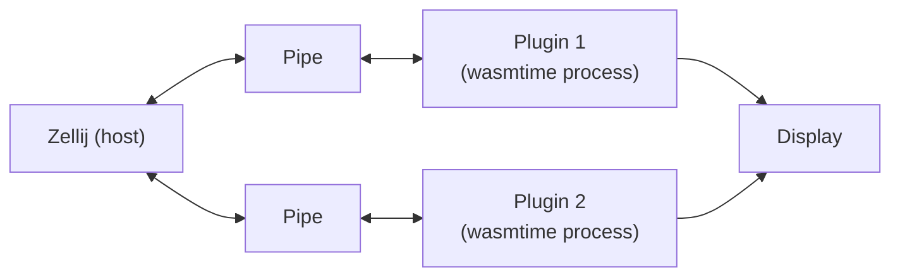

Who **runs untrusted code** in an **efficient** manner?

<v-click>

# The Web

</v-click>

---
layout: section
---
# Web Assembly
*Compiled JavaScript*

**standard** bytecode\
**safe and efficient** execution

---
---
# WASM Core
the original WebAssembly

<v-clicks>

- build to optimize slow JavaScript code 
- the idea behind being to run C code in the browser
- provides a C-ABI inspired *better* interface (sematic numbers - i32, u32, i64, u64, f32, f64)
- [strongly sanboxed]{style="color:orange"} 👮

</v-clicks>

<br>
<br>
<br>

<v-click>

<center>

*who doesn't want to run ~~*DOOM*~~ *QEMU* in the browser 😅*

</center>

</v-click>

---
layout: center
---
If we run DOOM in the browser (and shim all the lib-c), why can't we actually run outside the browser?

<v-click>

<div align="right">

# Meet WASI
WebAssembly System Interface (preview 1)

</div>

</v-click>

---
---
# WASI Preview 1
Running WASM Core outside the browser

- We can use this in Rust to build safe plugins!
- [Sandboxed]{style="color: green"} shared C-ABI libraries

Rust/LLVM provides multiple targets for WASM Core

| Target | What can we do |
|-|-|
| *wasm32-unknown-unknown* | access functions exported to WASM by the host |
| *wasm32-wasip1* | access platform functions in a [controlled]{style="color: orange"} manner |

---
---
# Supported Languages
that compile to the WASM Core backend

- Rust
- C/C++
- Kotlin 
- Java (TeaVM)
- Go
- JavaScript (SpiderMonkey / StarlingMonkey)
  - embedded JS engine

---
---
# Executor
to run WASM one needs an executor

| Executor | Description | Platforms |
|-|-|-|
| Browsers | All modern browsers provide WASM executors | N/A |
| NodeJS / Deno | V8 outside the browser | x86, AMD64, arm32, aarch64 |
| [`wasmtime`]{style="color: green"} | Written in Rust, based on `cranelift` | x86, AMD64, arm32, aarch64 |
| `wasmer` | Written in Rust | x86, AMD64, arm32, aarch64 |
| `WAMR` | Reference C interpreter, can run on embedded devices | all |

---
---
# Zellij Case Study
*A terminal workspace with batteries included*

WASM Core is not able to transfer complex data, so they use ... <v-click> [an stdio pipe]{style="color: orange"} </v-click>



<v-click>

Plugins can:
- written in any language that compiles to WASM - JavaScript included
- access the Zellij folder using their own standard library (each language has a different one)

</v-click>

---
---
# Zellij Plugin API
What developers is working with

```rust
pub trait ZellijPlugin: Default {
    fn load(&mut self, configuration: BTreeMap<String, String>) {}

    fn update(&mut self, event: Event) -> bool {
        false
    } // return true if it should render
    
    fn pipe(&mut self, pipe_message: PipeMessage) -> bool {
        false
    } // return true if it should render
    
    fn render(&mut self, rows: usize, cols: usize) {}
}
```

---
---

# Zellij Plugin API
What a plugin exports to Zellij

```rust {1,2,13-20,22|1,2,5,10,12|19,20,21,22,all}
#[no_mangle]
fn load() {
    STATE.with(|state| {
        /* ... */
        let protobuf_bytes: Vec<u8> = $crate::shim::object_from_stdin().unwrap();
        let protobuf_configuration: ProtobufPluginConfiguration =
            ProtobufPluginConfiguration::decode(protobuf_bytes.as_slice()).unwrap();
        let plugin_configuration: BTreeMap<String, String> =
            BTreeMap::try_from(&protobuf_configuration).unwrap();
        state.borrow_mut().load(plugin_configuration);
    });
}
#[no_mangle]
pub fn update() -> bool { /* ... */ }
#[no_mangle]
pub fn pipe() -> bool { /* ... */ }
#[no_mangle]
pub fn render(rows: i32, cols: i32) { /* ... */ }
#[no_mangle]
pub fn plugin_version() {
    println!("{}", $crate::prelude::VERSION);
}
```
